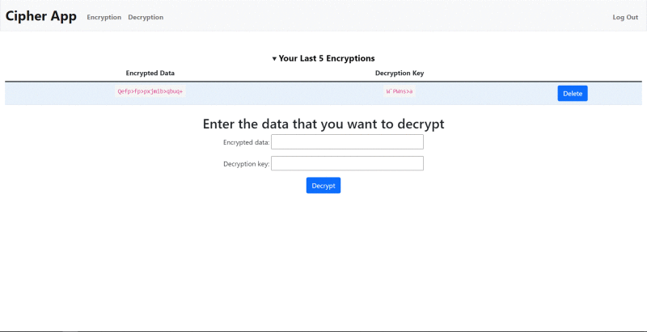

# CIPHER WEB APP
### Video Demo:  <https://youtu.be/nFcABpXPPqw>
## Summary:
  > I created a cipher web app, (*an innovation of the caesar cipher*), that enciphers and deciphers data using a randomly generated key that is encrypted and decrypted as well.
  > The algorithm produces safe cipher text, that can only be deciphered using my deciphering algorithm.

___

|**File / Folder**| Functionality                                        |
| :---------------| :--------------------------------------------------- |
| static folder   |Contains a css, javascript, images and favicon files             |
| templates folder| contains template (`.html`) files that are rendered  |
| flask_session and \__pycache\__ | collaborate to manage login sessions |
| app.py          | contains the logic for running the web app           |
| cipher.db       | databases that stores data as required               |
| helpers.py      | contains helper functions that are used in `app.py`  |
| requirements.txt| contains all the project dependencies used           | |
| `.html` files   | are files that are rendered and displayed by the app |

---
> To run the program, in two ways:
1. To run it in a development server
```python
    flask run
```
2. To run it in a production server
```python
    python3 app.py
```

*In both above cases, a link will be generated, where upon clicking, the web app will be running*

## **In-depth project description**
---

### Phase 1 -- **Logging in**
The user is welcomed by an enticing user interface design. The wavy animation gives the website more feeling and liveliness.

Using cs50's login authorization helper functions, I developed my own authorization and verification system. 

The user first logs into the web app in order to have access to the site. If they don't have an account, they create one, and the user's details are stored in a database. For the record, a hash of the password is stored, and not the actual password itself.

### Phase 2 -- **Home Page**
After successfully logging in, the user is directed to te homepage. This page gives a brief guide on what to expect ahead, and explains briefly the purpose of the website as well as a dive into it's future.

### Phase 3 -- **Encryption Page**
When the user heads to the encryption page, it renders the `encipher.html` file, which is simple and straight to the point.


When the user enters their data and clicks the button to encrypt, the following processes occur:

1. The data is retrieved using the `POST` method and stored in a variable as a string.
2. It is then [encrypted](https:// "Click to read the encryption logic") to generate the cipher text and decryption key.
3. The cipher text and the decryption key are then stored in the database.

>After encrypting, a new interface pops up that gives more details for the next step. A live alert emerges, informing the user that the encrypted data and decryption key are stored in the database, and that they should check the decryption page for more details.


### Phase 4 - **Decryption Page**
After the user gotten the cipher data (*Encryption key and Decryption key*), the desired result can be retrieved from the decryption page.
In this page, the app renders a simple interface that shows:

* Two input fields for receiving the cipher data.
* Last 5 sets of cipher data that were stored, in order of the most recent.




When the user enters the cipher data and clicks the button to decrypt, 5 main processes occur:

1. The cipher text and decryption key are fetched using the `POST` method stored in variables as strings.
2. The sets of cipher data are then [decrypted](https:// "Click to read the decryption process") to get the plain text that is then displayed.


## Conclusion
---
The project revolved around juggling both the frontend and backend areas of a website. This is in turn boosted my understanding of the web space and narrowed my preferences (frontend or backend) when it comes to web development. All in all, I really enjoyed this wholesome experience and hyped to learn even more with the CS50's courses.